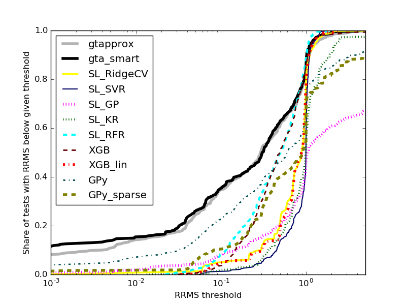
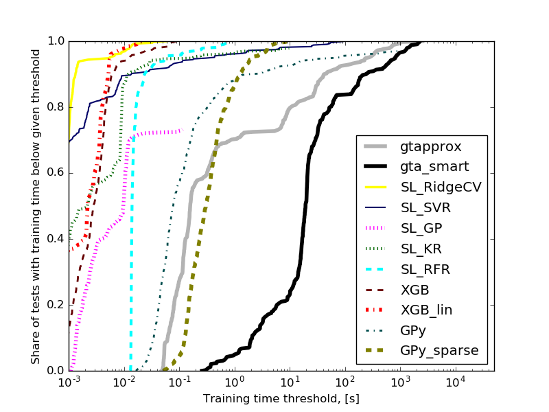

# GTApprox benchmark

These are scripts and data we used to compare GTApprox against several popular approximation libraries, as described in the paper **GTApprox: surrogate modeling for industrial design** ([journal publication](http://www.sciencedirect.com/science/article/pii/S0965997816303696), [arXiv preprint](https://arxiv.org/abs/1609.01088)). 

 

Run `runAllTests.py` to save results for all individual tests. (Each test is run in a separate process by first restricting available virtual memory (with `ulimit`, Linux-only) and then calling the script `runSingleTest.py`.) After completion, run `plotResults.py` to collect results and plot performance profiles.
